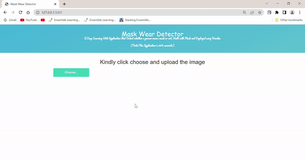

# Mask Wear Detector-DeepLearning

# Overview:

A simple web application which uses Deep Learning algorithm to detect Face mask, built using Flask 

# Motivation

As being a Data and ML enthusiast I have tried many different projects related to the subject but what I have realised
is that Deploying your machine learning model is a key aspect of every ML and Data science project. Everything thing I 
had studied or been taught so far in my Data science and ML journey had mostly focused on defining problem statement followed by Data collection
and preparation, model building and evaluation process which is of course important for every ML/DS project but what if I want different people to
interact with my models, how can I make my model available for end-users? I can't send them jupyter notebooks right!. That's why I wanted to try my hands
on complete end-to-end machine learning project.

# Deployed Application on Local host :

# Technical Aspect
This Project is mainly divided into two parts:

- Exploring various Transfer learning algorithm traning the model using best model.
- Building a flask web app 

# About the repository Structure :

- Project consist **app.py** script which is used to run the application and is engine of this app. contians API that gets input from the user and computes a predicted value based on the model.
- **Placement_Prediction.ipynb** contains code to build and train a Machine learning model.
- Templates folder contains two files **base.html** and **index.html** which describe the structure of the app and the way this web application behaves. These files are connected with Python via Flask framework.
- static folder contains file **main.css** which adds some styling and enhance the look of the application.

# Installation

The Code is written in Python 3.8. If you don't have Python installed you can find it here. If you are using a lower version of Python you can upgrade using the pip package, ensuring you have the latest version of pip. To install the required packages and libraries, run this command in the project directory after cloning the repository:

 pip install -r requirements.txt 
 
# Run

To Run the Application

python app.py 

# Deployement on Heroku
Install Heroku CLI as this makes it easy to create and manage your Heroku apps directly from the terminal. You can download it from [here](https://devcenter.heroku.com/articles/heroku-cli)

next step would be to follow the instruction given on [Heroku Documentation](https://devcenter.heroku.com/articles/getting-started-with-python) to deploy a web ap
